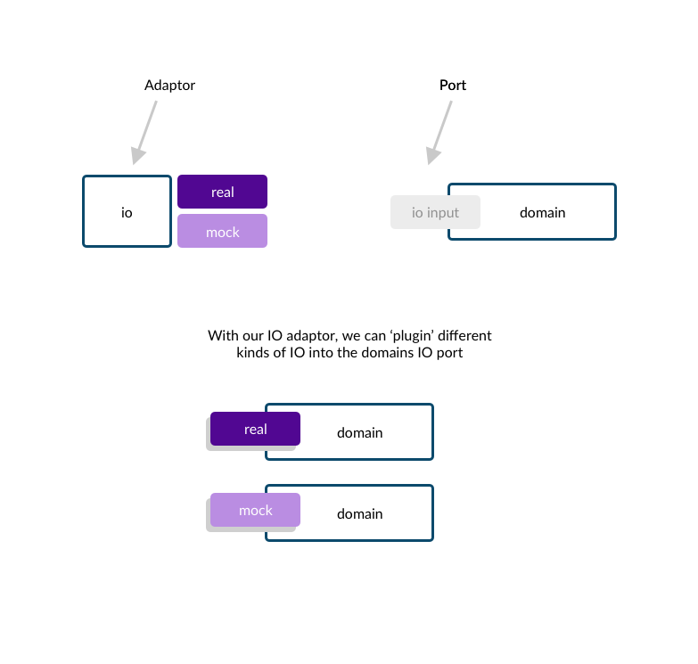
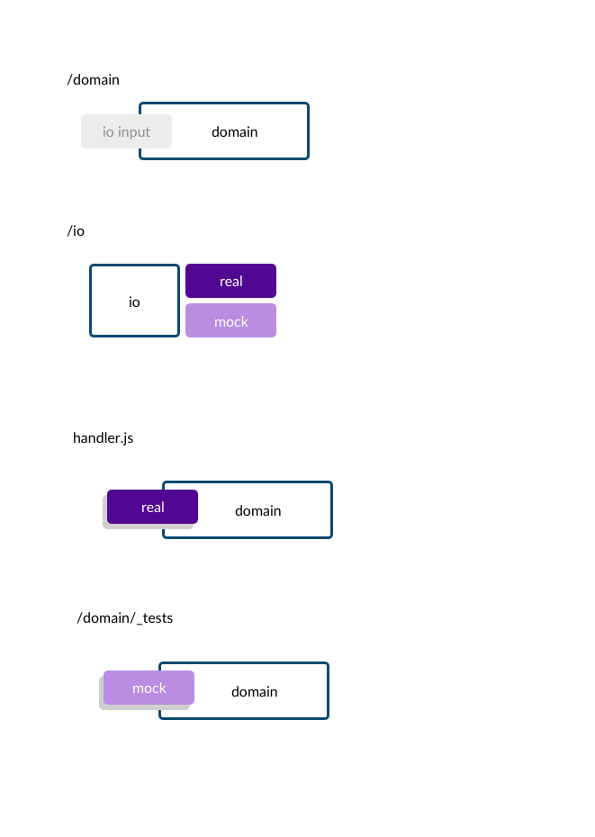
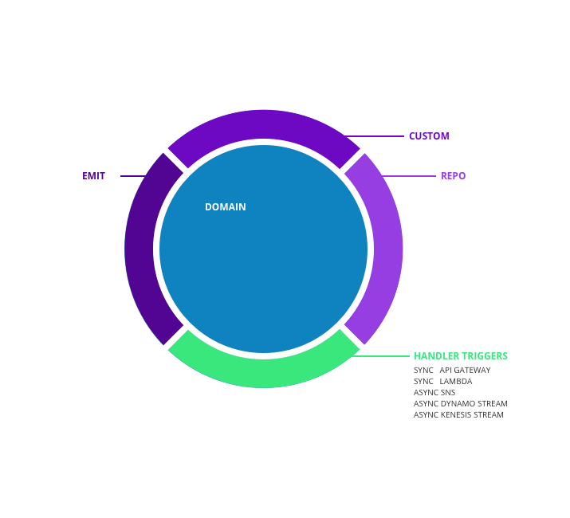
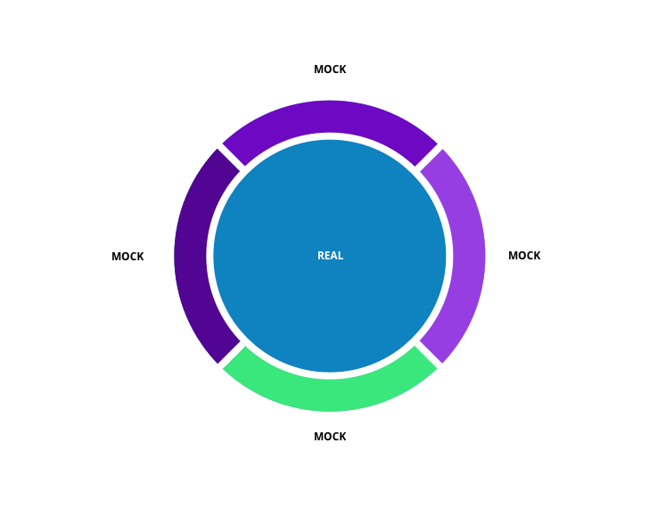
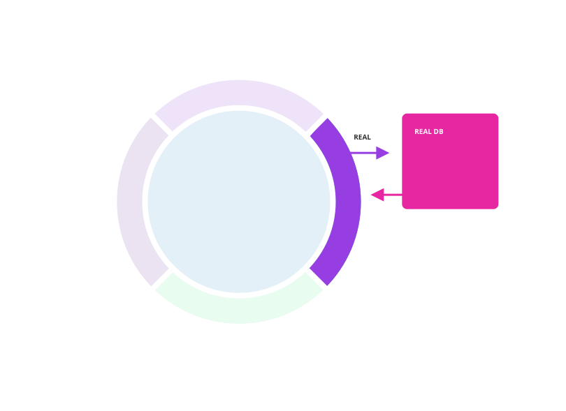

# Ports and Adaptors

Ports and Adaptors is an architecture pattern which helps you decouple your codebase. A decoupled codebase makes testing much more straightforward. So what is the idea behind ports and adators?

### What is Ports and Adaptors

Above is an image of a few components: 1. An IO component, 2. A Domain component. IO respresents all the ways in which your codebase interacts with the outside world, which could be databases, event emitters, emailers, external apis. Domain represents the business logic of your codebase.

Rather than hardcode all functions which interact with the outside world within your business logic, we can instead expose a port. This could, for eaxmple, be a parameter a function excepts.  This port will take in an IO object containing all IO helper functions. This allows us to 'plugin' different kinds of IO depending on the context, and keeps the domain or business logic free from any IO related decisions.

In the picture above, we can see that we can choose which IO object to plugin to our domain, mock or real. This gives us great flexibility.

### How would this look within a folder structure? 

#### Domain Folder
In our project, we could make a domain folder, which contains all domain or business logic functions. These functions do not explicitly make IO calls, but instead make use of an IO object given to it.

#### IO Folder
In our IO folder, we could make both our real and mock io objects, and allow our code to determine which version of IO it wants based on a configuration flag.

#### handler.js
The handler.js file is often the entry point in a lambda function. In this file, we can choose to plugin the real IO to the domain, which will result in the domain calling real resources when it is deployed.

#### Domain Test Folder
Within our domain tests, we can instead plugin a Mock IO object, which will allow us to test the business logic fast and deterministically.

### High Level Overview of Ports and Adaptors

If we were to zoom out of a project and take a overview, we could imagine a handler file (represented as green in the above image). This handler file will connect the real IO to the domain. We have our domain layer (which is represented as blue in the image above) which sits in the center. We can also have many kinds of IO (represented in purple)

The above image demonstrates different kinds of IO. We could have a repo, which typically represents communcation with databases (DynamoDB, Redis, MySQL). We could have event emitters (SQS, SNS, Eventbridge). We could also have custom IO like internal api REST or SOAP endpoints that our service needs to communicate with.

When it comes to testing, we can simply plugin mock versions of all our IO into our domain, and test it.

When it comes to testing the IO, we can take the real versions of our IO and test it against real outside resources.
